---

# TryHackMe — CTF Collection Vol.1
Room: [https://tryhackme.com/room/ctfcollectionvol1](https://tryhackme.com/room/ctfcollectionvol1)

---
## 🏁 Room Banner

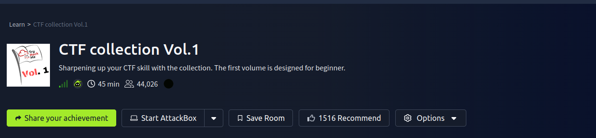

---
# Task 1 — Author note

This task introduces the room. No flag required.

---
# Task 2 — What does the base said?

### Challenge

```
VEhNe2p1NTdfZDNjMGQzXzdoM19iNDUzfQ==
```

### Analysis

The string is clearly Base64 encoded.

### Command

```bash
echo "VEhNe2p1NTdfZDNjMGQzXzdoM19iNDUzfQ==" | base64 -d
```
### Output
```
THM{ju57_d3c0d3_7h3_b453}
```

✅ **Flag**
```
THM{ju57_d3c0d3_7h3_b453}
```

---
# Task 3 — Meta meta

We are given an image file.
### Approach

Inspect metadata using `exiftool`.

```bash
exiftool Find_me_1577975566801.jpg
```


### Result

The flag is hidden inside metadata.
✅ **Flag**
```
THM{3x1f_0r_3x17}
```
---

# Task 4 — Mon, are we going to be okay?
This challenge involves **steganography**.
### Step 1 – Check embedded data

```bash
steghide info Extinction_1577976250757.jpg
```

```
embedded file: Final_message.txt
encrypted: rijndael-128
```
### Step 2 – Extract file

```bash
steghide extract -sf Extinction_1577976250757.jpg
```

### Step 3 – Read extracted content
```bash
cat Final_message.txt
```

Output:
```
THM{500n3r_0r_l473r_17_15_0ur_7urn}
```

✅ **Flag**
```
THM{500n3r_0r_l473r_17_15_0ur_7urn}
```

---
# Task 5 — Erm......Magick

This task uses ImageMagick analysis.
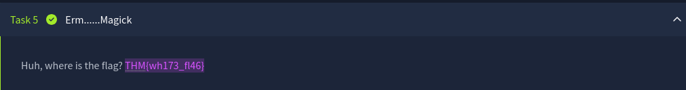

Hidden content reveals:
✅ **Flag**
```
THM{wh173_fl46}
```
---
# Task 6 — QRrrrr

Scan the QR code.
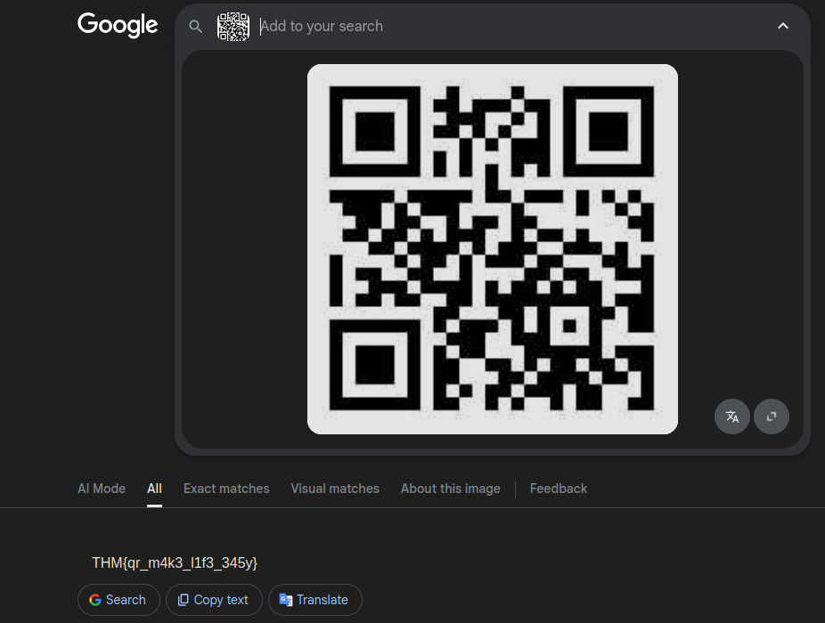

Decoded using any QR scanner.
✅ **Flag**
```
THM{qr_m4k3_l1f3_345y}
```
---

# Task 7 — Reverse it or read it?

Use `strings` to analyze the file.
```bash
strings hello_1577977122465.hello | grep THM
```

Output:
```
THM{345y_f1nd_345y_60}
```

✅ **Flag**
```
THM{345y_f1nd_345y_60}
```

---

# Task 8 — Another decoding stuff

Cipher:
```
3agrSy1CewF9v8ukcSkPSYm3oKUoByUpKG4L
```

Identified as **Base58**.
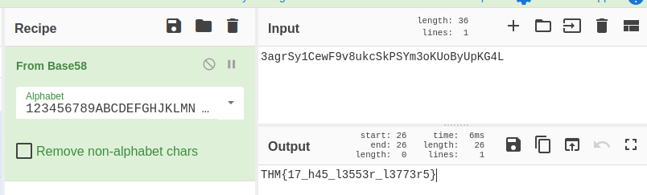

Decoded using CyberChef.
✅ **Flag**
```
THM{17_h45_l3553r_l3773r5}
```

---

# Task 9 — Left or right
Cipher:
```
MAF{atbe_max_vtxltk}
```

This is a Caesar cipher.
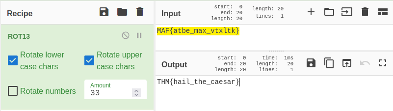

After shifting characters:

✅ **Flag**
```
THM{hail_the_caesar}
```

---
# Task 10 — Make a comment

Inspect page source (Right click → View Source).
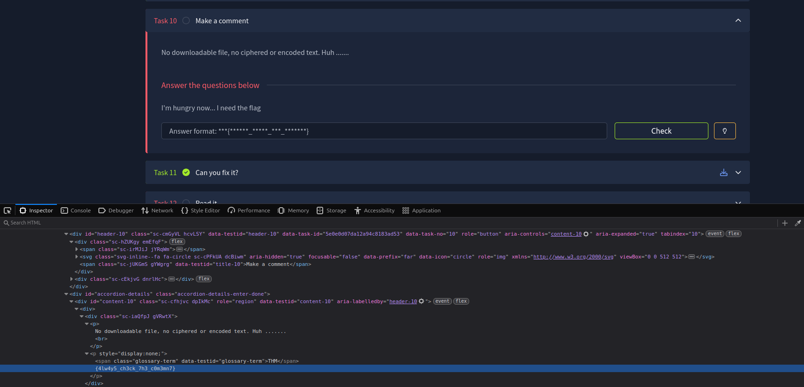

Hidden inside HTML comment.

✅ **Flag**
```
THM{4lw4y5_ch3ck_7h3_c0m3mn7}
```

---
# Task 11 — Can you fix it?

The image header is corrupted.
### Open with hex editor:
```bash
ghex spoil_1577979329740.png
```

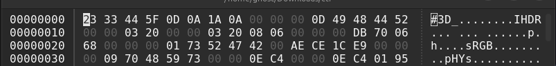

Fix PNG header manually.


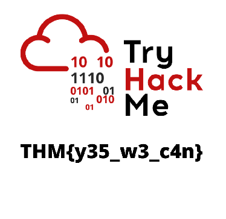

✅ **Flag**
```
THM{y35_w3_c4n}
```

---

# Task 12 — Read it

Hidden flag in TryHackMe Reddit post (OSINT).

✅ **Flag**

```
THM{50c14l_4cc0un7_15_p4r7_0f_051n7}
```

---

# Task 13 — Spin my head

Used cipher identifier:  
[https://www.dcode.fr/cipher-identifier](https://www.dcode.fr/cipher-identifier)

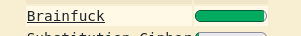

Decoded result:

✅ **Flag**

```
THM{0h_my_h34d}
```

---

# Task 14 — An exclusive!

Given hex string:

```
54484d7b3378636c75353176335f30727d
```

Convert hex → ASCII:

```bash
echo 54484d7b3378636c75353176335f30727d | xxd -r -p
```

Output:

```
THM{3xclu51v3_0r}
```

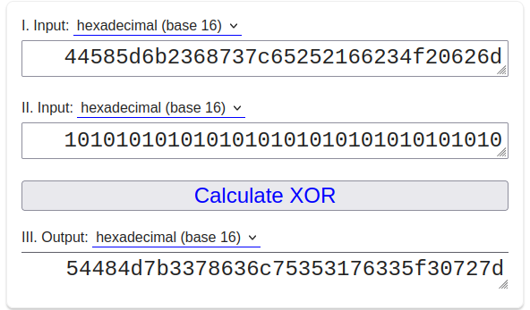

---

# Task 15 — Binary walk

Use `binwalk` to extract hidden zip.
```bash
binwalk -e hell_1578018688127.jpg
cd _hell_1578018688127.jpg.extracted
unzip 40E75.zip
cat hello_there.txt
```

Output:
```
THM{y0u_w4lk_m3_0u7}
```

---

# Task 16 — Darkness

Use StegOnline tool.

[https://georgeom.net/StegOnline/image](https://georgeom.net/StegOnline/image)

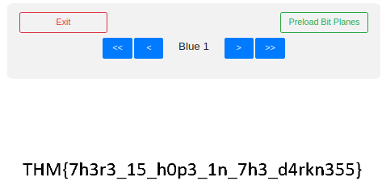
Hidden in color channels.

✅ **Flag**
```
THM{7h3r3_15_h0p3_1n_7h3_d4rkn355}
```

---

# Task 17 — A sounding QR

Analyze audio spectrogram.

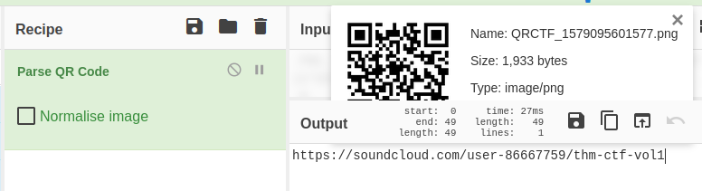
SoundCloud link:  
[https://soundcloud.com/user-86667759/thm-ctf-vol1](https://soundcloud.com/user-86667759/thm-ctf-vol1)

Spectrogram reveals QR code.

✅ **Flag**
```
THM{SOUNDINGQR}
```

---
# Task 18 — Dig up the past

Use Wayback Machine.
Target:
```
https://www.embeddedhacker.com
Date: 2 January 2020
```

[https://web.archive.org/](https://web.archive.org/)

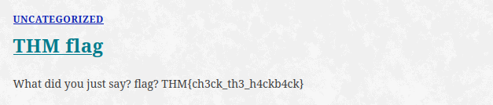

✅ **Flag**

```
THM{ch3ck_th3_h4ckb4ck}
```

---

# Task 19 — Uncrackable!

Cipher:

```
MYKAHODTQ{RVG_YVGGK_FAL_WXF}
```

Vigenère cipher.

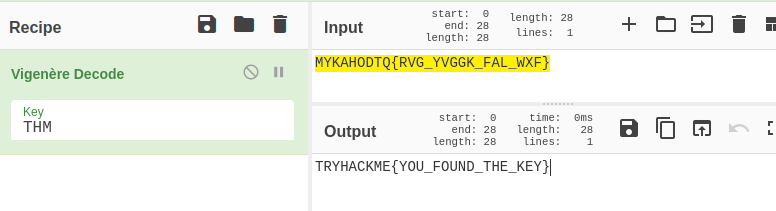

Decoded:

✅ **Flag**
```
TRYHACKME{YOU_FOUND_THE_KEY}
```

---

# Task 20 — Small bases

Given large decimal:

```
581695969015253365094191591547859387620042736036246486373595515576333693
```

Hint: dec → hex → ascii

Hex:
```
54484D7B31375F6A7535375F346E5F307264316E3472795F62343533357D
```

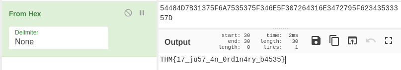

Decoded:

✅ **Flag**
```
THM{17_ju57_4n_0rd1n4ry_b4535}
```

---

# Task 21 — Read the packet

Analyze PCAP in Wireshark.

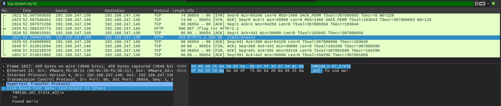

Extracted from packet stream.

✅ **Final Flag**
```
THM{d0_n07_574lk_m3}
```

---
## 🧑‍💻 Author

Ghost- Cybersecurity Learner & CTF Player
