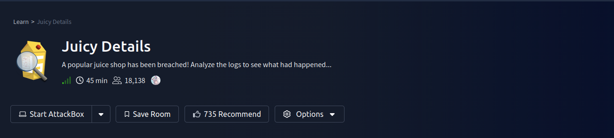
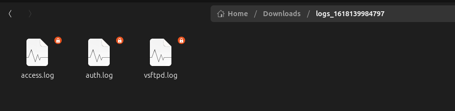
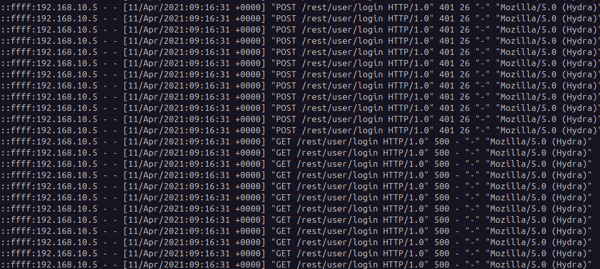
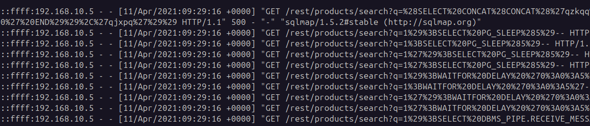
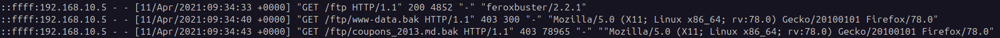
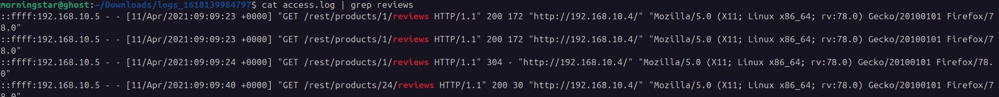
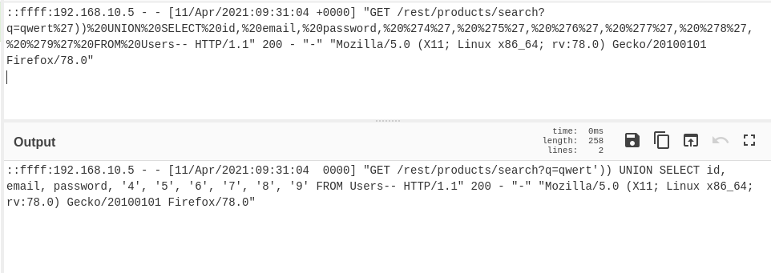
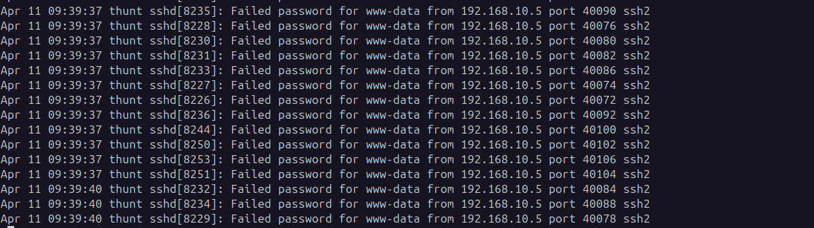

---

# TryHackMe Write-up: Juicy Details
[ROOM](https://tryhackme.com/room/juicydetails)


## Overview

This room focuses on analyzing multiple log files to reconstruct an attack timeline. The goal is to identify attacker behavior, exploited vulnerabilities, and data exfiltration techniques using logs such as:

- `access.log`
    
- `auth.log`
    
- `vsftpd.log`
    



---

## Reconnaissance

### Tools Used by the Attacker

By analyzing user-agent strings and request patterns in the logs, the attacker used the following tools in chronological order:

- nmap
    
- hydra
    
- sqlmap
    
- curl
    
- feroxbuster
    

---

### Brute-force Attack Endpoint

The attacker targeted the login endpoint:

```
/rest/user/login
```



This endpoint was repeatedly accessed using Hydra, indicating a credential brute-force attempt.

---

### SQL Injection Endpoint

The vulnerable endpoint identified:

```
/rest/products/search
```

The injection parameter:

```
q
```



This is confirmed through repeated crafted requests to:

```log
GET /rest/products/search?q=
```

---

### Attempt to Retrieve Files

The attacker attempted to access:

```
/ftp
```



This indicates enumeration of exposed file storage mechanisms.

---

## Stolen Data

### Email Scraping Location

The attacker scraped user email addresses from:

```
Product reviews section
```

This is evident from repeated requests:

```log
GET /rest/products/<id>/reviews
```



---

### Brute-force Attack Success

The brute-force attack **was successful**.

Timestamp of successful login:

```
11/Apr/2021:09:16:31 +0000
```

Evidence:

```log
cat access.log | grep Hydra | grep 200

::ffff:192.168.10.5 - - [11/Apr/2021:09:16:31 +0000] "POST /rest/user/login HTTP/1.0" 200 831 "-" "Mozilla/5.0 (Hydra)"
```

---

### Data Extracted via SQL Injection

The attacker retrieved:

- Email addresses
    
- Passwords
    



This indicates improper input sanitization and lack of parameterized queries.

---

### Files Downloaded by Attacker

The attacker downloaded the following files:

- coupons_2013.md.bak
    
- www-data.bak
    


This activity is confirmed in FTP logs:

```log
OK DOWNLOAD: "/www-data.bak"
OK DOWNLOAD: "/coupons_2013.md.bak"
```

---

### Service and Account Used for File Retrieval

Service:

```
FTP
```

Username:

```
anonymous (ftp)
```

Evidence:

```log
[ftp] OK LOGIN: Client "::ffff:192.168.10.5", anon password "IEUser@"
```

---

### Shell Access

The attacker attempted to gain shell access using:

- Service: SSH
    
- Username: www-data
    



Evidence from authentication logs:

```log
Failed password for www-data from 192.168.10.5
```

This indicates credential reuse attempts after obtaining sensitive data.

---

## Attack Timeline Summary

1. **Reconnaissance**
    
    - Nmap scanning and enumeration
        
2. **Enumeration**
    
    - Discovery of endpoints and API structure
        
3. **Exploitation**
    
    - SQL Injection on `/rest/products/search?q`
        
    - Brute-force attack on `/rest/user/login`
        
4. **Credential Access**
    
    - Extraction of emails and passwords
        
5. **Lateral Movement**
    
    - FTP login using anonymous access
        
    - Download of backup files
        
6. **Post-Exploitation**
    
    - SSH brute-force attempts using `www-data`
        

---
## 🧑‍💻 Author

Morningstar - Cyber security Learner & CTF Player

---
